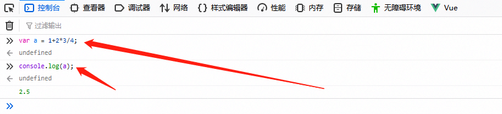

## JavaScript - 廖雪峰


## 1. JavaScript 简介

在上个世纪的1995年，当时的网景公司正凭借其Navigator浏览器成为Web时代开启时最著名的第一代互联网公司。

由于网景公司希望能在静态HTML页面上添加一些动态效果，于是叫Brendan Eich这哥们在两周之内设计出了JavaScript语言。你没看错，这哥们只用了10天时间。

### ECMAScript

因为网景开发了JavaScript，一年后微软又模仿JavaScript开发了JScript，为了让JavaScript成为全球标准，几个公司联合ECMA（European Computer Manufacturers  Association）组织定制了JavaScript语言的标准，被称为ECMAScript标准。

所以简单说来就是，ECMAScript是一种语言标准，而JavaScript是网景公司对ECMAScript标准的一种实现。

那为什么不直接把JavaScript定为标准呢？因为JavaScript是网景的注册商标。

不过大多数时候，我们还是用JavaScript这个词。如果你遇到ECMAScript这个词，简单把它替换为JavaScript就行了。

### JavaScript 版本

由于JavaScript的标准——ECMAScript在不断发展，最新版ECMAScript 6标准（简称ES6）已经在2015年6月正式发布了，所以，讲到JavaScript的版本，实际上就是说它实现了ECMAScript标准的哪个版本。


### ECMAScript 第一版标准发布于：

- [ ] 1995年
- [ ] 1996年
- [x] 1997年
- [ ] 1998年
- [ ] 2015年


## 2. 快速入门

JavaScript代码可以直接嵌在网页的任何地方，不过通常我们都把JavaScript代码放到 `<head>` 中：

```html
<html>
<head>
  <script>
    alert('Hello, world');
  </script>
</head>
<body>
  ...
</body>
</html>
```

由`<script>...</script>`包含的代码就是JavaScript代码，它将直接被浏览器执行。

第二种方法是把JavaScript代码放到一个单独的`.js`文件，然后在HTML中通过`<script src="..."></script>`引入这个文件：

```html
<html>
<head>
  <script src="/static/js/abc.js"></script>
</head>
<body>
  ...
</body>
</html>
```

这样，`/static/js/abc.js`就会被浏览器执行。

把JavaScript代码放入一个单独的`.js`文件中更利于维护代码，并且多个页面可以各自引用同一份`.js`文件。

可以在同一个页面中引入多个`.js`文件，还可以在页面中多次编写`<script>js代码...</script>`，浏览器**按照顺序依次执行**。

有些时候你会看到`<script>`标签还设置了一个`type`属性：

```html
<script type="text/javascript">
  ...
</script>
```

但这是没有必要的，因为默认的`type`就是JavaScript，所以**不必显式地把`type`指定为JavaScript**。


### 如何编写 JavaScript

可以用任何文本编辑器来编写JavaScript代码。这里我们推荐以下几种文本编辑器：


#### # Visual Studio Code

微软出的[Visual Studio Code](https://code.visualstudio.com/)，可以看做迷你版 `Visual Studio`，免费！跨平台！内置JavaScript支持，强烈推荐使用！


#### # Sublime Text

[Sublime Text](https://www.sublimetext.com/)是一个好用的文本编辑器，免费，但不注册会不定时弹出提示框。


### 如何运行 JavaScript

要让浏览器运行JavaScript，必须先有一个HTML页面，在HTML页面中引入JavaScript，然后，让浏览器加载该HTML页面，就可以执行`JavaScript`代码。

你也许会想，直接在我的硬盘上创建好HTML和JavaScript文件，然后用浏览器打开，不就可以看到效果了吗？

这种方式运行部分JavaScript代码没有问题，但由于浏览器的安全限制，以`file://`开头的地址无法执行如联网等JavaScript代码，最终，你还是需要架设一个Web服务器，然后以`http://`开头的地址来正常执行所有JavaScript代码。


### 如何调试

俗话说得好，“工欲善其事，必先利其器。”，写JavaScript的时候，如果期望显示`ABC`，结果却显示`XYZ`，到底代码哪里出了问题？不要抓狂，也不要泄气，作为小白，要坚信：JavaScript本身没有问题，浏览器执行也没有问题，有问题的一定是我的代码。

如何找出问题代码？这就需要调试。怎么在浏览器中调试JavaScript代码呢？

首先，你需要安装Google Chrome浏览器，Chrome浏览器对开发者非常友好，可以让你方便地调试JavaScript代码。从这里[下载Chrome浏览器](https://www.google.com/chrome/browser/desktop/index.html?system=true&standalone=1)。打开网页出问题的童鞋请移步[国内镜像](http://pan.baidu.com/s/1qWMaZSg#path=%2Fpub%2Fchrome)。

安装后，随便打开一个网页，然后点击菜单“查看(View)”-“开发者(Developer)”-“开发者工具(Developer Tools)”，浏览器窗口就会一分为二，下方就是开发者工具：



先点击“控制台(Console)“，在这个面板里可以直接输入JavaScript代码，按回车后执行。

要查看一个变量的内容，在Console中输入`console.log(a);`，回车后显示的值就是变量的内容。

关闭Console请点击右上角的“×”按钮。请熟练掌握Console的使用方法，在编写JavaScript代码时，经常需要在Console运行测试代码。

如果你对自己还有更高的要求，可以研究开发者工具的“源码(Sources)”，掌握断点、单步执行等高级调试技巧。


### 2.1 基本语法


#### 2.1.1 语法：

JavaScript的语法和Java语言类似，每个语句以`;`结束，语句块用`{...}`。但是，JavaScript并不强制要求在每个语句的结尾加`;`，浏览器中负责执行JavaScript代码的引擎会自动在每个语句的结尾补上`;`。

例如，下面的一行代码就是一个完整的赋值语句：

```js
var x = 1;
```

下面的一行代码是一个字符串，但仍然可以视为一个完整的语句：

```js
'Hello, world';
```

下面的一行代码包含两个语句，每个语句用`;`表示语句结束：

```js
var x = 1; var y = 2;
```

##### **语句块是一组语句的集合**。

例如，下面的代码先做了一个判断，如果判断成立，将执行`{...}`中的所有语句：

```js
if (2 > 1) {
   x = 1;
   y = 2;
   z = 3;
}
```

注意花括号`{...}`内的语句具有缩进，通常是4个空格。缩进不是JavaScript语法要求必须的，但缩进有助于我们理解代码的层次，所以编写代码时要遵守缩进规则。很多文本编辑器具有“自动缩进”的功能，可以帮助整理代码。

`{...}`还**可以嵌套**，形成层级结构：

```js
if (2 > 1) {
   x = 1;
   y = 2;
   z = 3;
   if (x < y) {
      z = 4;
   }
   if (x > y) {
      z = 5;
   }
}
```

JavaScript本身对嵌套的层级没有限制，但是过多的嵌套无疑会大大增加看懂代码的难度。遇到这种情况，需要把部分代码抽出来，作为函数来调用，这样可以减少代码的复杂度。


#### 2.1.2 注释

##### # 单行注释

以`//`开头直到行末的字符被视为行注释，注释是给开发人员看到，JavaScript引擎会自动忽略：

```js
// 这是一行注释
alert('hello'); // 这也是注释
```

##### # 块级注释

另一种块注释是用`/*...*/`把多行字符包裹起来，把一大“块”视为一个注释：

```js
/* 从这里开始是块注释
仍然是注释
仍然是注释
注释结束 */
```


#### 2.1.3 大小写

请注意，<font color="red">**JavaScript严格区分大小写**</font>，如果弄错了大小写，程序将报错或者运行不正常。

```js
var xyz = 2;
var xYz = 3;
console.log(xYz);  // 3
console.log(xyz);
```


### 2.2 数据类型和变量


#### 2.2.1 数据类型

计算机顾名思义就是可以做数学计算的机器。

因此，计算机程序理所当然地可以处理各种数值。但是，计算机能处理的远不止数值，还可以处理文本、图形、音频、视频、网页等各种各样的数据，不同的数据，需要定义不同的数据类型。

在JavaScript中定义了以下几种数据类型：


##### # Number

JavaScript不区分整数和浮点数，统一用Number表示，以下都是合法的Number类型：

```js
123; // 整数123
0.456; // 浮点数0.456
1.2345e3; // 科学计数法表示1.2345x1000，等同于1234.5
-99; // 负数
NaN; // NaN表示Not a Number，当无法计算结果时用NaN表示
Infinity; // Infinity表示无限大，当数值超过了JavaScript的Number所能表示的最大值时，就表示为Infinity
```

计算机由于使用二进制，所以，有时候用十六进制表示整数比较方便，十六进制用0x前缀和0-9，a-f表示，例如：`0xff00`，`0xa5b4c3d2`，等等，它们和十进制表示的数值完全一样。


**Number可以直接做四则运算**，规则和数学一致：

```js
1 + 2; // 3
(1 + 2) * 5 / 2; // 7.5
2 / 0; // Infinity
0 / 0; // NaN
10 % 3; // 1
10.5 % 3; // 1.5
```

注意`%`是求余运算（整除后返回余数）。


##### # 字符串

字符串是以单引号'或双引号"括起来的任意文本，比如`'abc'`，`"xyz"`等等。请注意，`''`或`""`本身只是一种表示方式，不是字符串的一部分，因此，字符串`'abc'`只有`a`，`b`，`c`这3个字符。


##### # 布尔值

布尔值和布尔代数的表示完全一致，一个布尔值只有`true`、`false`两种值，要么是`true`，要么是`false`，可以直接用`true`、`false`表示布尔值，也可以通过布尔运算计算（关系运算符）出来：

```js
true; // 这是一个true值
false; // 这是一个false值
2 > 1; // 这是一个true值
2 >= 3; // 这是一个false值
```

###### ## 与运算 （&&）

`&&`运算是与运算（and），只有所有都为`true`，`&&`运算结果才是`true`：

```js
true && true; // 这个&&语句计算结果为true
true && false; // 这个&&语句计算结果为false
false && true && false; // 这个&&语句计算结果为false
```


###### ## 或运算（||）

`||`运算是或运算（or），只要其中有一个为`true`，`||`运算结果就是`true`：

```js
false || false; // 这个||语句计算结果为false
true || false; // 这个||语句计算结果为true
false || true || false; // 这个||语句计算结果为true
```


> javascript 中没有 ‘and’ 和 ‘or’


###### ## 非运算（!）

`!`运算是非运算，它是一个**单目运算符**，把`true`变成`false`，`false`变成`true`：

```js
! true; // 结果为false
! false; // 结果为true
! (2 > 5); // 结果为true
```

布尔值经常用在条件判断中，比如：

```js
var age = 15;
if (age >= 18) {
    alert('adult');
} else {
    alert('teenager');
}
```


#### 2.3 比较运算符

当我们对Number做比较时，可以通过比较运算符得到一个布尔值：

```js
2 > 5; // false
5 >= 2; // true
7 == 7; // true
```

实际上，JavaScript允许对任意数据类型做比较：

```js
false == 0; // true
false === 0; // false
```


##### 2.3.1  == 和 ===

要特别注意相等运算符`==`。JavaScript在设计时，有两种比较运算符：

第一种是`==`比较，**它会自动转换数据类型再比较**，很多时候，会得到非常诡异的结果；

第二种是`===`比较，**它不会自动转换数据类型**，如果数据类型不一致，返回`false`，如果一致，再比较。

**由于JavaScript这个设计缺陷，*不要*使用`==`比较，始终坚持使用`===`比较。**


##### 2.3.2 NaN（Not a Number）

另一个例外是`NaN`这个特殊的Number与所有其他值都不相等，包括它自己：

```JS
NaN === NaN; // false
```

唯一能判断`NaN`的方法是通过`isNaN()`函数：

```js
isNaN(NaN); // true
```

最后要注意浮点数的相等比较：

```js
1 / 3 === (1 - 2 / 3); // false
```

这不是JavaScript的设计缺陷。浮点数在运算过程中会产生误差，因为计算机无法精确表示无限循环小数。要比较两个浮点数是否相等，只能计算它们之差的绝对值，看是否小于某个阈(yu)值：

```js
Math.abs(1 / 3 - (1 - 2 / 3)) < 0.0000001; // true
```


##### 2.3.3 `null`和`undefined`

`null`表示一个“空”的值，它和`0`以及空字符串`''`不同，`0`是一个数值，`''`表示长度为0的字符串，而`null`表示“空”。

在其他语言中，也有类似JavaScript的`null`的表示，例如Java也用`null`，Swift用`nil`，Python用`None`表示。但是，在JavaScript中，还有一个和`null`类似的`undefined`，它表示“未定义”。

JavaScript的设计者希望用`null`表示一个空的值，而`undefined`表示值未定义。

事实证明，这并没有什么卵用，区分两者的意义不大。大多数情况下，我们都应该用`null`。`undefined`仅仅在判断函数参数是否传递的情况下有用。


##### 2.3.4 数组

数组是一组按顺序排列的集合，集合的每个值称为元素。JavaScript的数组可以包括任意数据类型。例如：

```js
[1, 2, 3.14, 'Hello', null, true];
```

上述数组包含6个元素。数组用`[]`表示，元素之间用`,`分隔。

另一种创建数组的方法是通过`Array()`函数实现：

```js
new Array(1, 2, 3); // 创建了数组[1, 2, 3]
```

然而，出于代码的可读性考虑，强烈建议直接使用`[]`。

数组的元素可以通过索引来访问。请注意，索引的起始值为`0`：

```js
var arr = [1, 2, 3.14, 'Hello', null, true];
arr[0]; // 返回索引为0的元素，即1
arr[5]; // 返回索引为5的元素，即true
arr[6]; // 索引超出了范围，返回undefined
```

> 请注意超出索引值的访问将返回 undefined


##### 2.3.5 对象

JavaScript的对象是**一组由键-值组成的无序集合**，例如：

```js
var person = {
    name: 'Bob',
    age: 20,
    tags: ['js', 'web', 'mobile'],
    city: 'Beijing',
    hasCar: true,
    zipcode: null
};
```

JavaScript对象的**键**（Key）都是字符串类型，值可以是任意数据类型。上述`person`对象一共定义了6个键值对，其中每个键又称为对象的属性，例如，`person`的`name`属性为`'Bob'`，`zipcode`属性为`null`。

要获取一个对象的属性，我们用`对象变量.属性名`的方式：

```js
person.name; // 'Bob'
person.zipcode; // null
```


#### 2.3.6 变量

变量的概念基本上和初中代数的方程变量是一致的，只是在计算机程序中，变量不仅可以是数字，还可以是任意数据类型。

变量在JavaScript中就是用一个变量名表示，变量名是大小写英文、数字、`$`和`_`的组合，且不能用数字开头。

变量名也不能是JavaScript的关键字，如`if`、`while`等。申明一个变量用`var`语句，比如：

```js
var a; // 申明了变量a，此时a的值为undefined
var $b = 1; // 申明了变量$b，同时给$b赋值，此时$b的值为1
var s_007 = '007'; // s_007是一个字符串
var Answer = true; // Answer是一个布尔值true
var t = null; // t的值是null
```

变量名也可以用中文，但是，请不要给自己找麻烦。

在JavaScript中，使用等号`=`对变量进行赋值。可以把任意数据类型赋值给变量，同一个变量可以反复赋值，而且可以是不同类型的变量，但是要注意只能用`var`申明一次，例如：

```js
var a = 123; // a的值是整数123
a = 'ABC'; // a变为字符串
```

**这种变量本身类型不固定的语言称之为动态语言（也称弱类型语言），与之对应的是静态语言**。

静态语言在定义变量时必须指定变量类型，如果赋值的时候类型不匹配，就会报错。例如Java是静态语言，赋值语句如下：

```java
int a = 123; // a是整数类型变量，类型用int申明
a = "ABC"; // 错误：不能把字符串赋给整型变量
```

和静态语言相比，动态语言更灵活，就是这个原因（也更难控制）。

请不要把赋值语句的等号等同于数学的等号。比如下面的代码：

```js
var x = 10;
x = x + 2;
```

